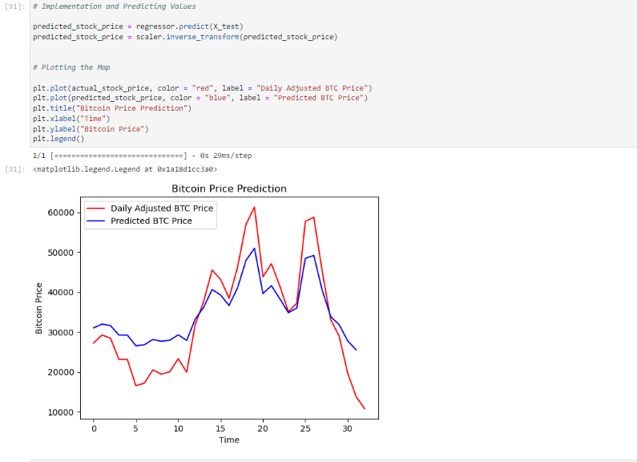

# Stock-CryptoPredictionML

This repository contains code for predicting the price of stocks and cryptocurrencies, using a Long Short-Term Memory (LSTM) neural network. 
The LSTM model is trained on historical price data and used to make predictions on unseen data.

## Data Preparation

The dataset used in this project is obtained from **AlphaVantage** [here](https://www.alphavantage.co/), a popular financial data provider. 
AlphaVantage offers a wide range of financial market data, including historical price information for stocks and cryptocurrencies.

The dataset used for training and testing the model is stored in a CSV file for e.g. (`currency_monthly_BTC_CNY.csv`). 
The dataset is loaded using pandas, and the relevant price column (e.g., "Open" price for stocks or "openinUSD" for cryptocurrencies) is extracted as the training data. 
The training data is then scaled using the MinMaxScaler from scikit-learn to normalize the values between 0 and 1.

## Model Architecture

The LSTM model is built using the Keras library. The model architecture consists of multiple LSTM layers with dropout regularization to prevent overfitting. The number of units in each LSTM layer can be adjusted according to your needs. The model is compiled with the Adam optimizer and the mean squared error loss function.

## Model Training

The model is trained on the prepared training data (`X_train` and `Y_train`) for a specified number of epochs and batch size. During training, the model learns to minimize the mean squared error loss between the predicted and actual prices of the financial asset.

## Model Evaluation

After training, the model is used to make predictions on the test data (`X_test`). The predicted prices are then rescaled to their original range using the MinMaxScaler. To evaluate the performance of the model, both the actual and predicted prices are plotted on a graph. This allows you to visually compare the predicted prices with the ground truth. Additionally, you can calculate evaluation metrics such as Mean Squared Error (MSE) or Root Mean Squared Error (RMSE) to assess the accuracy of the predictions.


Figure 1: The model can predict the trend of the actual stock prices very closely. The accuracy of the model can be enhanced by training with more data and increasing the LSTM layers.

## Usage

To use this code for your own financial price prediction task, follow these steps:

1. Prepare your dataset: Ensure you have a CSV file containing historical price data for the financial asset you want to predict. Make sure the CSV file has a column for the relevant price (e.g., "Open" price for stocks or "openinUSD" for cryptocurrencies).

2. Update the file paths: Modify the code to point to your dataset file by updating the file paths where the dataset is loaded ```(`dataset_train = pd.read_csv("currency_monthly_BTC_CNY.csv")`)``` and where the predictions are evaluated ```(`dataset_test = pd.read_csv("currency_monthly_BTC_CNY.csv")`)```.

3. Adjust the model parameters: If needed, modify the model architecture by changing the number of LSTM layers or the number of units in each layer ```(`regressor.add(LSTM(units = 50, return_sequences = True))`)```. You can also experiment with different dropout rates ```(`regressor.add(Dropout(0.2))`)``` to control overfitting.

4. Train and evaluate the model: Run the code to train the model on your dataset ```(`regressor.fit(X_train, Y_train, epochs = 100, batch_size = 32)`)``` and evaluate the model's performance on the test data ```(`predicted_stock_price = regressor.predict(X_test)`)```.

5. Visualize the results: Plot the actual and predicted prices on a graph to visually assess the model's predictions ```(`plt.plot(actual_stock_price, color = "red", label = "Actual Price")``` and ```plt.plot(predicted_stock_price, color = "blue", label = "Predicted Price")`)```.

## Why LSTM?

When it comes to predicting financial prices, such as stocks and cryptocurrencies, LSTM (Long Short-Term Memory) neural networks have demonstrated superior performance compared to other traditional and machine learning models. 
1. **Ability to Capture Long-Term Dependencies**: LSTM networks are specifically designed to handle sequences of data, making them well-suited for time series analysis.
2. **Handle Nonlinear interactions**: LSTM models can effectively capture nonlinear relationships between past price patterns and future price movements.
3. **Robustness to Noisy and Irregular Data**: LSTM networks are resilient to noisy data and can effectively filter out short-term fluctuations, focusing on capturing the underlying                                                  trends and patterns that are more relevant for price prediction.
**While other models, such as traditional statistical models or other deep learning architectures, may also be suitable for this, LSTM has gained popularity due to its ability to handle sequential data, capture long-term dependencies, and model nonlinear relationships effectively.**

Feel free to modify the code and experiment with different configurations to improve the model's performance. Additionally, you can explore other datasets or use different financial instruments for prediction.

## Acknowledgments
Special thanks to AlphaVantage for providing the financial price data used in this project.

If you have any questions or suggestions, please feel free to reach out.
